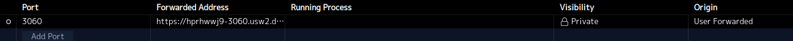
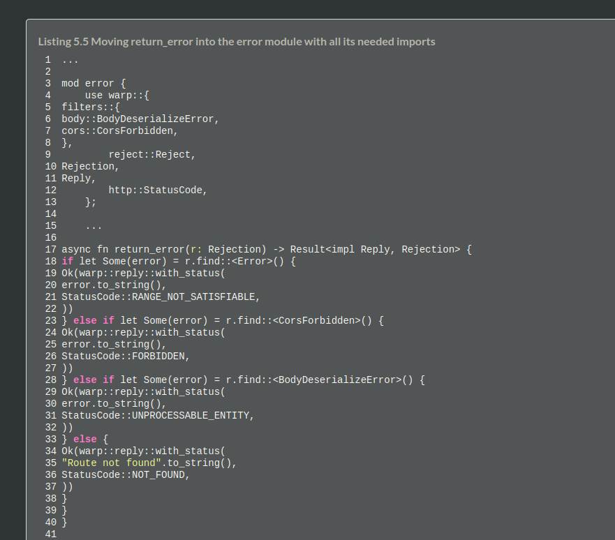

<!-- trunk-ignore-all(prettier) -->
# Rust Web Examples<!-- omit from toc -->

Cordet Gula  
CS510 Rust Web Dev SPR 2024  
MCECS  
Professor: Bart Massey

## About<!-- omit from toc -->

Rust Web Example is a course repo dedicated to Rust Web Development. The focus of this repo will be demonstrating web dev skills [*in rust*], such as providing a web service, REST API, backend, frontend, and more. 

## Table of Contents<!-- omit from toc -->

<!-- trunk-ignore(markdownlint/MD033) -->
<details>
<!-- trunk-ignore(markdownlint/MD033) -->
<summary>Rust Web Examples</summary>
<!-- blank line-->

+ [Assignments](#assignments)
+ [Setup](#setup)
    + [Repo](#repo)
    + [Docker](#docker)
+ [Chapters](#chapters)
    + [Chapter 1](#chapter-1)
    + [Chapter 2](#chapter-2)
    + [Chapter 3](#chapter-3)
    + [Chapter 4](#chapter-4)
    + [Chapter 5](#chapter-5)
    + [Chapter 6](#chapter-6)
    + [Chapter 7](#chapter-7)
    + [Chapter 8](#chapter-8)
    + [Chapter 9](#chapter-9)
    + [Chapter 10](#chapter-10)
    + [Chapter 11](#chapter-11)
+ [Front End](#front-end)
+ [Error Notes](#error-notes)
+ [MISC. Notes](#misc-notes)
+ [Acknowledgments](#acknowledgments)
+ [References](#references)
+ [License](#license)

</details>

<!-- End TOC -->

## Assignments

To make access to the specific assignments easier, I made this guide to point to the corresponding write-ups in repo.

Homework 1: Git Repo Started.

Homework 2: Chapter 4: Implement a RESTful API   
[Assignment README documented section](#chapter-4)  

To see the server working from chapter 3 for a question: see [ch3-web](#chapter-3)

Homework 3: Persistent Data
[Assignment README documented section up to ch. 9](#chapter-9)

Homework 4: Front-End
[Assignment README documented section up to and including ch. 11](#chapter-11)

## Setup

```sh
# Setup Chapter as Package
──> cargo new ch*-web

# Setting up tokio:
──> cargo add tokio --features full

# Setting up header
──> cargo add axum-extra -F typed-header

# Generate cargo docs
──> cargo doc --open

# In package: Check settings
──> cargo verify-project
```

### Repo

The below setup was a dumb idea -- but that's my M.O. -- making things harder than they have to be.

I am changing the setup to include the hello -- chapter one -- package, but then deleting and combining all the other code into a single backend package.

The frontend is setup as a seperate crate from the backend.

~~Each chapter is set up as a separate rust binary package. The reason why I implemented the repo this way was because it helps me conceptualize how the chapters from the book build on each other. It also allows me to reference prior chapters' examples.~~  

~~I could have probably set it up differently, such as a single package with multiple binaries and/or modules, but I went about it as a multi-package project instead.~~

<!-- trunk-ignore(markdownlint/MD033) -->
<details>
<!-- trunk-ignore(markdownlint/MD033) -->
<summary>See: Repo setup</summary>

```txt
# No. This was dumb
main branch
└── hello/ # Chapter 1
    └── hello v0.1.0
├── ch2-web/
    └── ch2-web v0.1.0
├── ch3-web/
    └── ch3-web v0.1.0
├── ch4-web/
    └── ch4-web v0.1.0
├── ch5-web/
    └── ch5-web v0.1.0
├── ch6-web/
    └── ch6-web v0.1.0
├── ch7-web/
    └── ch7-web v0.1.0
├── ch8-web/
    └── ch8-web v0.1.0
├── ch9-web/
    └── ch9-web v0.1.0
├── ch10-web/
    └── ch10-web v0.1.0
├── ch11-web/
    └── ch11-web v0.1.0
├── assets/
├── .gitignore
├── error-notes.md
├── README
└── LICENSE
```

```txt
# This is the new setup
main branch
└── hello/ # Chapter 1
    └── hello v0.1.0
├── frontend/
    └── frontend v0.1.2
├── backend/
    └── backend v0.1.0
├── assets/
├── .gitignore
├── error-notes.md
├── README
└── LICENSE
```

</details> 
</br>

To make sure the rust-analyzer server could build my project(s) properly, I set the workspace ```settings.json``` to link the specific packages:

<!-- trunk-ignore(markdownlint/MD033) -->
<details>
<!-- trunk-ignore(markdownlint/MD033) -->
<summary>See: Rust-Analyzer Settings</summary>

```json
{
    "docwriter.custom.author": "Cordet Gula",
    "docwriter.style": "RustDoc",
    "rust-analyzer.linkedProjects": [
        "./hello/Cargo.toml",
        "./backend/Cargotoml",
        "./frontend/Cargo.toml"
    ]
}
```

</details> 

### Docker

Initially, I tried setting up docker via the Docker Desktop GUI, but just kept getting errors. So, I set it up using the terminal:

```zsh
──> docker init

Welcome to the Docker Init CLI!

This utility will walk you through creating the following files with sensible defaults for your project:
  - .dockerignore
  - Dockerfile
  - compose.yaml
  - README.Docker.md

Let's get started!

? What application platform does your project use? Rust
? What version of Rust do you want to use? 21
? What port does your server listen on? 3040

✔ Created → .dockerignore
✔ Created → Dockerfile
✔ Created → compose.yaml
✔ Created → README.Docker.md

→ Your Docker files are ready!
  Review your Docker files and tailor them to your application.
  Consult README.Docker.md for information about using the generated files.

What's next?
  Start your application by running → docker compose up --build
  Your application will be available at http://localhost:3040
```

Gave up on docker -- read the [error notes here](./error-notes.md).

<!-- Chapter Reports -->
## Chapters

### Chapter 1

Basic server up and running from chapter 1:


<!-- Checking -->
Passes cargo clippy

```zsh
$ cargo clippy
    Checking hello v0.1.0 (<path>)
    Finished dev [unoptimized + debuginfo] target(s) in 0.11s
```

### Chapter 2

<!--Checking Cargo clippy-->
Note: I updated my zsh format.

Passes cargo clippy

```zsh
┌─(~/Desktop/git_local/rust_web/ch2-web)
└─(01:41:15 on main ✹)──> cargo clippy
    Finished dev [unoptimized + debuginfo] target(s) in 0.09s
```

### Chapter 3

Passes `cargo clippy`

```zsh
┌─(~/Desktop/git_local/rust_web/ch3-web)
└─(19:27:49 on main)──> cargo clippy
    Finished dev [unoptimized + debuginfo] target(s) in 0.11s
```

The web-server on port 3080 is working as expected!


### Chapter 4

Passes `cargo clippy`

```zsh
┌─(~/Desktop/git_local/rust_web/ch4-web)
└─(23:13:18 on main)──> cargo clippy
    Finished dev [unoptimized + debuginfo] target(s) in 0.11s
```

<!-- Current -->

### Chapter 5

### Chapter 6

### Chapter 7

Create a database

```sh
# install sqlx
cargo install sqlx-cli
    ...
    Installed package `sqlx-cli v0.7.4` (executables `cargo-sqlx`, `sqlx`)
```

Example from book:

```sql
$ psql postgres
postgres=# create database rustwebdev;
CREATE DATABASE
postgres=# \l
    Name    |  Owner  | Encoding | Collate | Ctype |  Access privileges
------------+---------+----------+---------+-------+---------------------
 postgres   | bgruber | UTF8     | C       | C     |
 rustwebdev | bgruber | UTF8     | C       | C     |
(2 rows)
```

### Chapter 8

### Chapter 9

**NOTES:** When referencing the knock-knock joke class repo, I checked a couple things after the pull to the cloned repo:

```sh
--> cargo verify-project
    {"success":"true"}

--> cargo search utoipa-{rapidoc, redoc, swagger-ui}

# I should've done this instead
──> cargo update

# After updating the versions, check that the version updates compiled
--> cargo check
```

The 3 utoipa crates above were not at the latest version, so I went ahead and updated those. rapidoc and redoc are on version 4.0.0 and swagger-ui is on version 7.1.0. 

Running `cargo check` ran successfully so I can infer that the updates were compatible.

:bulb: **Ideas:**

+ I saw that reqwest has a  `auth` package -- making a note here to review later.

### Chapter 10

### Chapter 11

## Front End

Cloned the knock-knock-yew repo, then renamed the package.

```sh
──> cargo clone https://github.com/pdx-cs-rust-web/knock-knock-yew

    Cloning into 'knock-knock-yew'...
    remote: Enumerating objects: 67, done.
    remote: Counting objects: 100% (67/67), done.
    remote: Compressing objects: 100% (30/30), done.
    remote: Total 67 (delta 29), reused 67 (delta 29), pack-reused 0
    Receiving objects: 100% (67/67), 9.27 KiB | 9.27 MiB/s, done.
    Resolving deltas: 100% (29/29), done.

──> cargo renamepkg knock-knock-yew frontend

    you are going to rename this package from [knock-knock-yew] to [frontend] (y/N)
    y
    completed

──> cargo check 
    error[E0463]: can't find crate for `core`
    |
    = note: the `wasm32-unknown-unknown` target may not be installed
    = help: consider downloading the target with `rustup target add wasm32-unknown-unknown`

──> rustup target add wasm32-unknown-unknown

    info: downloading component 'rust-std' for 'wasm32-unknown-unknown'
    info: installing component 'rust-std' for 'wasm32-unknown-unknown'

──> cargo check
    Checking frontend v0.1.0 (../git_local/rust_web/frontend)
    Finished `dev` profile [unoptimized + debuginfo] target(s) in 8.48s

──> cargo install trunk
    Finished `release` profile [optimized] target(s) in 2m 34s
  Installing /.cargo/bin/trunk
   Installed package `trunk v0.20.2` (executable `trunk`)
```

I realized that the `.trunk` directory needed to be in the frontend crate. Prior to that, there was no serve command. So, moving the trunk directory allowed me to run the code with `trunk serve`.

```sh
──> trunk serve

2024-06-12T20:47:19.421601Z  INFO 🚀 Starting trunk 0.20.2
2024-06-12T20:47:19.510505Z  INFO 📦 starting build
   Compiling cfg-if v1.0.0
    ...
   Compiling yew v0.21.0 (https://github.com/yewstack/yew/#dbdd3b78)
   Compiling frontend v0.1.0 (/git_local/rust_web/frontend)
    Finished `dev` profile [unoptimized + debuginfo] target(s) in 10.58s
2024-06-12T20:47:31.946281Z  INFO downloading wasm-bindgen version="0.2.92"
2024-06-12T20:47:32.667319Z  INFO installing wasm-bindgen
2024-06-12T20:47:33.447249Z  INFO applying new distribution
2024-06-12T20:47:33.449925Z  INFO ✅ success
2024-06-12T20:47:33.450129Z  INFO 📡 serving static assets at -> /
2024-06-12T20:47:33.450507Z  INFO 📡 server listening at:
2024-06-12T20:47:33.450522Z  INFO     🏠 http://127.0.0.1:8080/
2024-06-12T20:47:33.450531Z  INFO     🏠 http://[::1]:8080/
2024-06-12T20:47:33.451075Z  INFO 📦 starting build
    Finished `dev` profile [unoptimized + debuginfo] target(s) in 0.07s
2024-06-12T20:47:34.574146Z  INFO applying new distribution
2024-06-12T20:47:34.579199Z  INFO ✅ success

```

*sigh* Well, this is progress, I guess. 


## Error Notes

To better help with my personal understanding of the content, I noted errors I came across in [the error-notes.md file](./error-notes.md).

## MISC. Notes

I decided to try to add the port `3060` as used in my application to vscode to see if it would be of any benefit for running a service.


As mentioned in class, I agree that the book was... not the best. I disliked that when following the examples, they would write it one way, then discuss why *not* to write it that way and delete half of what we had spent a bunch of time writing. I don't agree with that as a method of teaching, especially under time constraints. I personally prefer concise ways of discussion as to *why* one way is preferable. I can understand the discussion of why one way is preffered over another, but I don't agree with *teaching* the non-preffered way first -- it's misleading and confusing. They changed the same functions so many times that I ended up sifting through mountains of errors.

While I liked the `live book` on the manning website due to it being interactive, the formatting of the code examples were all over the place -- so it definately needs some improvement as well. See screenshot below:



## Acknowledgments

Thanks to Bart Massey for teaching the course material and for the examples provided in the jokes repository that was a helpful resource to implementing the web server, database, etc.

Thanks to the developers of tokio and axum.

Thanks to the developers of mintlify for making doc comments easier to write.

## References  

Gruber, Bastian. Rust Web Development

<!-- trunk-ignore(markdownlint/MD034) -->
https://github.com/Rust-Web-Development/code

<!-- trunk-ignore(markdownlint/MD034) -->
https://github.com/tokio-rs/axum

<!-- trunk-ignore(markdownlint/MD034) -->
https://github.com/pdx-cs-rust-web

<!-- trunk-ignore(markdownlint/MD034) -->
https://www.shuttle.rs/blog/2023/12/06/using-axum-rust

<!-- trunk-ignore(markdownlint/MD034) -->
https://docs.rs/axum/latest/axum/

[Mintlify Doc Writer](https://marketplace.visualstudio.com/items?itemName=mintlify.document)

[Docker & Rust](https://docs.docker.com/language/rust/?uuid=2475bfc7-4dda-4e0b-9eb8-333f3d77c9c4%0A)

[Docker Hub Images](https://hub.docker.com/?utm_source=docker4mac_4.29.0&utm_medium=hub&utm_campaign=referral&uuid=2475bfc7-4dda-4e0b-9eb8-333f3d77c9c4%0A)

[Docker Install: Debian](https://docs.docker.com/desktop/install/debian/)

<!-- trunk-ignore(markdownlint/MD034) -->
https://lib.rs/crates/cargo-renamepkg

GitHub Co-Pilot

## License

This project is licensed with the [MIT license](./LICENSE).

---
<!-- Link to top of README -->

[&uarr; Back to Top](README.md#rust-web-examples)
