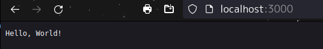
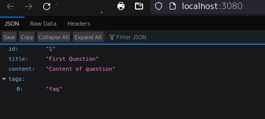

# Rust Web Examples<!-- omit from toc -->

Cordet Gula  
CS510 Rust Web Dev SPR 2024  
MCECS  
Professor: Bart Massey

## About<!-- omit from toc -->

Rust Web Example is a course repo dedicated to Rust Web Development. The focus of this repo will be demonstrating web dev skills [*in rust*], such as providing a web service, REST API, backend, frontend, and more. 

## Table of Contents<!-- omit from toc -->

<details>
<summary>Rust Web Examples</summary>
<!-- blank line-->

+ [Assignments](#assignments)
+ [Setup](#setup)
    + [Repo](#repo)
+ [Chapters](#chapters)
    + [Chapter 1](#chapter-1)
    + [Chapter 2](#chapter-2)
    + [Chapter 3](#chapter-3)
    + [Chapter 4](#chapter-4)
    + [Chapter 5](#chapter-5)
    + [Chapter 6](#chapter-6)
    + [Chapter 7](#chapter-7)
    + [Chapter 8](#chapter-8)
    + [Chapter 9](#chapter-9)
    + [Chapter 10](#chapter-10)
    + [Chapter 11](#chapter-11)
+ [Error Notes](#error-notes)
+ [Acknowledgments](#acknowledgments)
+ [References](#references)
+ [License](#license)

</details>

<!-- End TOC -->

## Assignments

To make access to the specific assignments easier, I made this guide to point to the corresponding package in repo.

Chapter 4: Implement a RESTful API  
['Get The REST Up' package](./ch4-web)  
[Assignment README documented section](#chapter-4)  

To see the server working from chapter 3 for a question: see [ch3-web](#chapter-3)

## <!-- End of Get-the-REST-Up --><!-- omit from toc -->

Persistent Data
[Chapter 9](./ch9-web)
[Assignment README documented section](#chapter-9)

## Setup

```sh
# Setup Chapter as Package
──> cargo new ch*-web

# Setting up tokio:
──> cargo add tokio --features full

# Setting up header
──> cargo add axum-extra -F typed-header

# Generate cargo docs
──> cargo doc --open

# In package: Check settings
──> cargo verify-project
```

### Repo

The below setup was a dumb idea -- but that's my M.O. -- making things harder than they have to be.

I am changing the setup to include the hello -- chapter one -- package, but then deleting and combining all the other code into a single package.

~~Each chapter is set up as a separate rust binary package. The reason why I implemented the repo this way was because it helps me conceptualize how the chapters from the book build on each other. It also allows me to reference prior chapters' examples.~~  

~~I could have probably set it up differently, such as a single package with multiple binaries and/or modules, but I went about it as a multi-package project instead.~~

<details>
<summary>See: Repo setup</summary>

```txt
# No. This was dumb
main branch
└── hello/ # Chapter 1
    └── hello v0.1.0
├── ch2-web/
    └── ch2-web v0.1.0
├── ch3-web/
    └── ch3-web v0.1.0
├── ch4-web/
    └── ch4-web v0.1.0
├── ch5-web/
    └── ch5-web v0.1.0
├── ch6-web/
    └── ch6-web v0.1.0
├── ch7-web/
    └── ch7-web v0.1.0
├── ch8-web/
    └── ch8-web v0.1.0
├── ch9-web/
    └── ch9-web v0.1.0
├── ch10-web/
    └── ch10-web v0.1.0
├── ch11-web/
    └── ch11-web v0.1.0
├── assets/
├── .gitignore
├── error-notes.md
├── README
└── LICENSE
```

```txt
# This is the new setup
main branch
└── hello/ # Chapter 1
    └── hello v0.1.0
├── questions/
    └── questions v0.1.2
├── assets/
├── .gitignore
├── error-notes.md
├── README
└── LICENSE
```

</details> 
</br>

To make sure the rust-analyzer server could build my project(s) properly, I set the workspace ```settings.json``` to link the specific packages:

<details>
<summary>See: Rust-Analyzer Settings</summary>

```json
{
    "docwriter.custom.author": "Cordet Gula",
    "docwriter.style": "RustDoc",
    "rust-analyzer.linkedProjects": [
        "./hello/Cargo.toml",
        "./questions/carg.toml"
    ]
}
```

</details> 

<!-- Chapter Reports -->
## Chapters

### Chapter 1

Basic server up and running from chapter 1:



<!-- Checking -->
Passes cargo clippy

```zsh
$ cargo clippy
    Checking hello v0.1.0 (<path>)
    Finished dev [unoptimized + debuginfo] target(s) in 0.11s
```

### Chapter 2

<!--Checking Cargo clippy-->
Note: I updated my zsh format.

Passes cargo clippy

```zsh
┌─(~/Desktop/git_local/rust_web/ch2-web)
└─(01:41:15 on main ✹)──> cargo clippy
    Finished dev [unoptimized + debuginfo] target(s) in 0.09s
```

### Chapter 3

Passes `cargo clippy`

```zsh
┌─(~/Desktop/git_local/rust_web/ch3-web)
└─(19:27:49 on main)──> cargo clippy
    Finished dev [unoptimized + debuginfo] target(s) in 0.11s
```

The web-server on port 3080 is working as expected!



### Chapter 4

Passes `cargo clippy`

```zsh
┌─(~/Desktop/git_local/rust_web/ch4-web)
└─(23:13:18 on main)──> cargo clippy
    Finished dev [unoptimized + debuginfo] target(s) in 0.11s
```

TODO:

Having issues understanding how to convert warp::filter to axum. From what I understand, axum uses a service instead of a filter.

But I'm still working on this...

<!-- Current -->

### Chapter 5

### Chapter 6

### Chapter 7

### Chapter 8

### Chapter 9

**NOTES:** When referencing the knock-knock joke class repo, I checked a couple things after the pull to the cloned repo:

```sh
--> cargo verify-project
    {"success":"true"}

--> cargo search utoipa-{rapidoc, redoc, swagger-ui}

# After updating the versions, check that the version updates compiled
--> cargo check
```

The 3 utoipa crates above were not at the latest version, so I went ahead and updated those. rapidoc and redoc are on version 4.0.0 and swagger-ui is on version 7.1.0. 

Running `cargo check` ran successfully so I can infer that the updates were compatible.

:bulb: **Ideas:**

+ I saw that reqwest has a  `auth` package -- making a note here to review later.

### Chapter 10

### Chapter 11

## Error Notes

To better help with my personal understanding of the content, I noted errors I came across in [the error-notes.md file](./error-notes.md).

## Acknowledgments

Thanks to Bart Massey for teaching the course material and for the examples provided in the jokes repository.

Thanks to the developers of tokio and axum.

Thanks to the developers of mintlify for making doc comments easier to write.

## References  

Gruber, Bastian. Rust Web Development

https://github.com/Rust-Web-Development/code

https://github.com/tokio-rs/axum

https://github.com/pdx-cs-rust-web

https://www.shuttle.rs/blog/2023/12/06/using-axum-rust

https://docs.rs/axum/latest/axum/

[Mintlify Doc Writer](https://marketplace.visualstudio.com/items?itemName=mintlify.document)

[Docker & Rust](https://docs.docker.com/language/rust/?uuid=2475bfc7-4dda-4e0b-9eb8-333f3d77c9c4%0A)

[Docker Hub Images](https://hub.docker.com/?utm_source=docker4mac_4.29.0&utm_medium=hub&utm_campaign=referral&uuid=2475bfc7-4dda-4e0b-9eb8-333f3d77c9c4%0A)

[Docker Install: Debian](https://docs.docker.com/desktop/install/debian/)

## License

This project is licensed with the [MIT license](./LICENSE).

---
<!-- Link to top of README -->

[&uarr; Back to Top](README.md#rust-web-examples)
