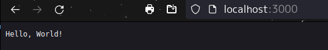

# Rust Web Example

Cordet Gula  
CS510 Rust Web Dev SPR 2024  
MCECS  
Professor: Bart Massey

## About

Rust Web Example is a course repo dedicated to Rust Web Development. The focus of this repo will be demonstrating web dev skills [*in rust*], such as providing a web service, REST API, backend, frontend, and more.  

## Setup

<!-- Setup Section -->

Setting up tokio:

```zsh
$ cargo add tokio --features full
```

<!-- Code Snippets -->
## Chapters

### Chapter 1

Basic server up and running from chapter 1:



<!-- Checking -->
Passes cargo clippy

```zsh
$ cargo clippy
    Checking hello v0.1.0 (<path>)
    Finished dev [unoptimized + debuginfo] target(s) in 0.11s
```

## Chapter 2

<!-- Enter Output & process -->

## Chapter 3

<!-- Current -->

## Error Notes

To better help with my personal understanding of the content, I noted errors I came across in [the error-notes.md file](./error-notes.md).

## Acknowledgments

Thanks to Bart Massey for teaching the course material.

Thanks to the developers of tokio and axum.

Thanks to the developers of mintlify for making doc comments easier to write.

## License

This project is licensed with the [MIT license](./LICENSE).

## References  

Gruber, Bastian. Rust Web Development

https://github.com/Rust-Web-Development/code

https://github.com/tokio-rs/axum

https://github.com/pdx-cs-rust-web

https://www.shuttle.rs/blog/2023/12/06/using-axum-rust

https://docs.rs/axum/latest/axum/

[Mintlify Doc Writer](https://marketplace.visualstudio.com/items?itemName=mintlify.document)
