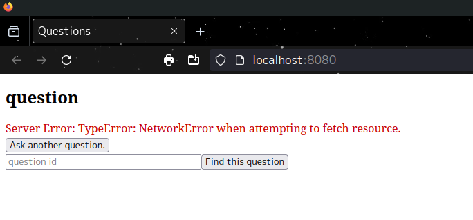
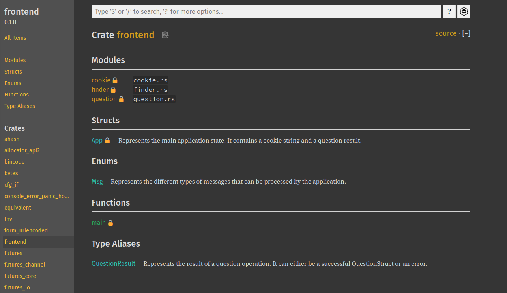
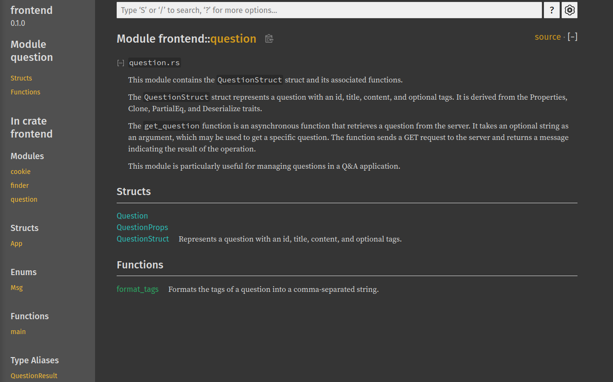

<!-- trunk-ignore-all(prettier) -->
# Rust Web Examples<!-- omit from toc -->

Cordet Gula  
CS510 Rust Web Dev SPR 2024  
MCECS  
Professor: Bart Massey

## About<!-- omit from toc -->

Rust Web Example is a course repo dedicated to Rust Web Development. The focus of this repo will be demonstrating web dev skills [*in rust*], such as providing a web service, REST API, backend, frontend, and more. 

## Table of Contents<!-- omit from toc -->

<!-- trunk-ignore(markdownlint/MD033) -->
<details>
<!-- trunk-ignore(markdownlint/MD033) -->
<summary>Rust Web Examples</summary>
<!-- blank line-->

+ [What I Learned](#what-i-learned)
    + [Things I could work on](#things-i-could-work-on)
+ [Assignments](#assignments)
+ [Setup](#setup)
    + [Repo](#repo)
    + [Docker](#docker)
+ [Chapters](#chapters)
    + [Chapter 1](#chapter-1)
    + [Chapter 2](#chapter-2)
    + [Chapter 3](#chapter-3)
    + [Chapter 4](#chapter-4)
    + [Chapter 5](#chapter-5)
    + [Chapter 6](#chapter-6)
    + [Chapter 7](#chapter-7)
    + [Chapter 8](#chapter-8)
    + [Chapter 9](#chapter-9)
    + [Chapter 10](#chapter-10)
    + [Chapter 11](#chapter-11)
+ [Front End](#front-end)
    + [Docs](#docs)
+ [Error Notes](#error-notes)
+ [MISC. Notes](#misc-notes)
+ [Acknowledgments](#acknowledgments)
+ [References](#references)
+ [License](#license)

</details>

<!-- End TOC -->

## What I Learned

While I don't consider my project to be completely successful, I learned a lot about integrating rust into web development. I also gained a better understanding of the workings of rust language itself. For example, when creating submodules from chapter 5, I realized that adding the mod.rs helps the compiler connect all the submodules so main can integrate them. 

I also got to see how cookies and authentication is written and what their uses are. Prior to this class, my basic understanding of cookies was just annoying trackers that popup on almost every website. As far as authentication from websites, I knew *what* it was but did not have a strong understanding of *how* they worked -- something that this class helped me gain a better understanding of; even if we couldn't get it fully implemented. 

A vast majority of my time was spent just trying to correct compilation errors because trying to integrate axum into the book examples got rather confusing -- in part because I think the book could use some improvement as I would get lost on what files the author was changing -- he wasn't very clear about that and I would end up frustrated. Only when I came across a link to the [book's code repo](https://github.com/Rust-Web-Development/code/blob/main/) was I able to understand that there were multiple modules and submodules. 

If I had more time to work on this, I would have liked to utilize more frontend stuff and create a favicon and the like. I would also have liked to really get the thing up and running better. I also intended to utilize the [test-api script from the class repo](https://github.com/pdx-cs-rust-web/knock-knock/blob/main/test-api.py) to update and run it on my code, but I didn't quite get to that. I also didn't get a chance to really clean it up nad complete my docs -- but the backend was a beast.

### Things I could work on

I know that I have limited experience in some concepts regarding web-dev which ended up being some of my struggling points. I'd argue however, that struggling -- and by extension fixing errors -- helps me learn how it works more than by successfully completing it `accidently`. 

I know that I have limited knowledge in how databases function in the integration of we development backend, so this is a key point for me to study more on. I found that the book didn't really explain it all that well and it seemed like there was some implied knowledge in the book -- which for me, is difficult for me to fill in those gaps. I like material that doesn't assume you know what the author knows.

I do still need to fill in some gaps for integrating all the pieces of web-dev with rust as there was a lot of moving parts and argueably, not enough time to poke at things and learn how they work; but I did my best in the allotted time. This is a class I could see needing to be in *at least* 2 classes if it were taught in the future. 

Docker... Holy mother-of-god was docker a *docking* pain *hehe*. I couldn't get the thing to work -- and yeah, good documentation is important. It's precisely these examples of poor documentation that I try to incorporate decent documention in my code and README so there is minimal guessing as to what my thought process was.

Trunk also had a learning curve, but I was able to get it to work -- so it's not too bad. I would like to get a better understanding of how trunk works in the future.

## Assignments

To make access to the specific assignments easier, I made this guide to point to the corresponding write-ups in repo.

Homework 1: Git Repo Started.

Homework 2: Chapter 4: Implement a RESTful API   
[Assignment README documented section](#chapter-4)  

To see the server working from chapter 3 for a question: see [ch3-web](#chapter-3)

Homework 3: Persistent Data
[Assignment README documented section up to ch. 9](#chapter-9)

Homework 4: Front-End
[Assignment README documented section up to and including ch. 11](#chapter-11)

## Setup

```sh
# Setup Chapter as Package
──> cargo new ch*-web

# Setting up tokio:
──> cargo add tokio --features full

# Setting up header
──> cargo add axum-extra -F typed-header

# Generate cargo docs
──> cargo doc --open

# In package: Check settings
──> cargo verify-project
```

### Repo

The below setup was a dumb idea -- but that's my M.O. -- making things harder than they have to be.

I am changing the setup to include the hello -- chapter one -- package, but then deleting and combining all the other code into a single backend package.

The frontend is setup as a seperate crate from the backend.

~~Each chapter is set up as a separate rust binary package. The reason why I implemented the repo this way was because it helps me conceptualize how the chapters from the book build on each other. It also allows me to reference prior chapters' examples.~~  

~~I could have probably set it up differently, such as a single package with multiple binaries and/or modules, but I went about it as a multi-package project instead.~~

<!-- trunk-ignore(markdownlint/MD033) -->
<details>
<!-- trunk-ignore(markdownlint/MD033) -->
<summary>See: Repo setup</summary>

```txt
# No. This was dumb
main branch
└── hello/ # Chapter 1
    └── hello v0.1.0
├── ch2-web/
    └── ch2-web v0.1.0
├── ch3-web/
    └── ch3-web v0.1.0
├── ch4-web/
    └── ch4-web v0.1.0
├── ch5-web/
    └── ch5-web v0.1.0
├── ch6-web/
    └── ch6-web v0.1.0
├── ch7-web/
    └── ch7-web v0.1.0
├── ch8-web/
    └── ch8-web v0.1.0
├── ch9-web/
    └── ch9-web v0.1.0
├── ch10-web/
    └── ch10-web v0.1.0
├── ch11-web/
    └── ch11-web v0.1.0
├── assets/
├── .gitignore
├── error-notes.md
├── README
└── LICENSE
```

```txt
# This is the new setup
main branch
└── hello/ # Chapter 1
    └── hello v0.1.0
├── frontend/
    └── frontend v0.1.2
├── backend/
    └── backend v0.1.0
├── assets/
├── .gitignore
├── error-notes.md
├── README
└── LICENSE
```

</details> 
</br>

To make sure the rust-analyzer server could build my project(s) properly, I set the workspace ```settings.json``` to link the specific packages:

<!-- trunk-ignore(markdownlint/MD033) -->
<details>
<!-- trunk-ignore(markdownlint/MD033) -->
<summary>See: Rust-Analyzer Settings</summary>

```json
{
    "docwriter.custom.author": "Cordet Gula",
    "docwriter.style": "RustDoc",
    "rust-analyzer.linkedProjects": [
        "./hello/Cargo.toml",
        "./backend/Cargotoml",
        "./frontend/Cargo.toml"
    ]
}
```

</details> 

### Docker

Initially, I tried setting up docker via the Docker Desktop GUI, but just kept getting errors. So, I set it up using the terminal:

```zsh
──> docker init

Welcome to the Docker Init CLI!

This utility will walk you through creating the following files with sensible defaults for your project:
  - .dockerignore
  - Dockerfile
  - compose.yaml
  - README.Docker.md

Let's get started!

? What application platform does your project use? Rust
? What version of Rust do you want to use? 21
? What port does your server listen on? 3040

✔ Created → .dockerignore
✔ Created → Dockerfile
✔ Created → compose.yaml
✔ Created → README.Docker.md

→ Your Docker files are ready!
  Review your Docker files and tailor them to your application.
  Consult README.Docker.md for information about using the generated files.

What's next?
  Start your application by running → docker compose up --build
  Your application will be available at http://localhost:3040
```

Gave up on docker -- read the [error notes here](./error-notes.md).

<!-- Chapter Reports -->
## Chapters

### Chapter 1

Basic server up and running from chapter 1:


<!-- Checking -->
Passes cargo clippy

```zsh
$ cargo clippy
    Checking hello v0.1.0 (<path>)
    Finished dev [unoptimized + debuginfo] target(s) in 0.11s
```

### Chapter 2

<!--Checking Cargo clippy-->
Note: I updated my zsh format.

Passes cargo clippy

```zsh
┌─(~/Desktop/git_local/rust_web/ch2-web)
└─(01:41:15 on main ✹)──> cargo clippy
    Finished dev [unoptimized + debuginfo] target(s) in 0.09s
```

### Chapter 3

Passes `cargo clippy`

```zsh
┌─(~/Desktop/git_local/rust_web/ch3-web)
└─(19:27:49 on main)──> cargo clippy
    Finished dev [unoptimized + debuginfo] target(s) in 0.11s
```

The web-server on port 3080 is working as expected!


### Chapter 4

Passes `cargo clippy`

```zsh
┌─(~/Desktop/git_local/rust_web/ch4-web)
└─(23:13:18 on main)──> cargo clippy
    Finished dev [unoptimized + debuginfo] target(s) in 0.11s
```

### Chapter 5

Cleaning up the crate.

Once I found the repo, I could see better how the author was working on the code examples. In the book, it was just a series of vague disconnected examples. As such I re-organized my backend crate to use submodules.

```txt
backend/
    routes/
        answer.rs
        mod.rs
        question.rs
    types/
        answer.rs
        mod.rs
        pagination.rs
        question.rs
    api.rs
    appstate.rs
    error.rs
    main.ra
    startup.rs
    store.rs
    web.rs
```

I could have probably done more to organize it better, but this is good enough for now.

### Chapter 6

Logging.

I was a little uncertain on the procedure for logging, but I implemented a line in main based on the book example.
Looking at the repo, he somehow generated `.log` and `.yaml` files which I am still a little lost on.

```rust
    let log_filter: String = std::env::var("RUST_LOG")
        .unwrap_or_else(|_| "handle_errors=warn,backend=warn,axum=warn".to_owned());
```

### Chapter 7

Create a database

```sh
# install sqlx
cargo install sqlx-cli
    ...
    Installed package `sqlx-cli v0.7.4` (executables `cargo-sqlx`, `sqlx`)
```

Example from book:

```sql
$ psql postgres
postgres=# create database rustwebdev;
CREATE DATABASE
postgres=# \l
    Name    |  Owner  | Encoding | Collate | Ctype |  Access privileges
------------+---------+----------+---------+-------+---------------------
 postgres   | bgruber | UTF8     | C       | C     |
 rustwebdev | bgruber | UTF8     | C       | C     |
(2 rows)
```

### Chapter 8

### Chapter 9

**NOTES:** When referencing the knock-knock joke class repo, I checked a couple things after the pull to the cloned repo:

```sh
--> cargo verify-project
    {"success":"true"}

--> cargo search utoipa-{rapidoc, redoc, swagger-ui}

# I should've done this instead
──> cargo update

# After updating the versions, check that the version updates compiled
--> cargo check
```

The 3 utoipa crates above were not at the latest version, so I went ahead and updated those. rapidoc and redoc are on version 4.0.0 and swagger-ui is on version 7.1.0. 

Running `cargo check` ran successfully so I can infer that the updates were compatible.

:bulb: **Ideas:**

+ I saw that reqwest has a  `auth` package -- making a note here to review later.

### Chapter 10

### Chapter 11

## Front End

Cloned the knock-knock-yew repo, then renamed the package.

```sh
──> cargo clone https://github.com/pdx-cs-rust-web/knock-knock-yew

    Cloning into 'knock-knock-yew'...
    remote: Enumerating objects: 67, done.
    remote: Counting objects: 100% (67/67), done.
    remote: Compressing objects: 100% (30/30), done.
    remote: Total 67 (delta 29), reused 67 (delta 29), pack-reused 0
    Receiving objects: 100% (67/67), 9.27 KiB | 9.27 MiB/s, done.
    Resolving deltas: 100% (29/29), done.

──> cargo renamepkg knock-knock-yew frontend

    you are going to rename this package from [knock-knock-yew] to [frontend] (y/N)
    y
    completed

──> cargo check 
    error[E0463]: can't find crate for `core`
    |
    = note: the `wasm32-unknown-unknown` target may not be installed
    = help: consider downloading the target with `rustup target add wasm32-unknown-unknown`

──> rustup target add wasm32-unknown-unknown

    info: downloading component 'rust-std' for 'wasm32-unknown-unknown'
    info: installing component 'rust-std' for 'wasm32-unknown-unknown'

──> cargo check
    Checking frontend v0.1.0 (../git_local/rust_web/frontend)
    Finished `dev` profile [unoptimized + debuginfo] target(s) in 8.48s

──> cargo install trunk
    Finished `release` profile [optimized] target(s) in 2m 34s
  Installing /.cargo/bin/trunk
   Installed package `trunk v0.20.2` (executable `trunk`)
```

I realized that the `.trunk` directory needed to be in the frontend crate. Prior to that, there was no serve command. So, moving the trunk directory allowed me to run the code with `trunk serve`.

```sh
──> trunk serve

2024-06-12T20:47:19.421601Z  INFO 🚀 Starting trunk 0.20.2
2024-06-12T20:47:19.510505Z  INFO 📦 starting build
   Compiling cfg-if v1.0.0
    ...
   Compiling yew v0.21.0 (https://github.com/yewstack/yew/#dbdd3b78)
   Compiling frontend v0.1.0 (/git_local/rust_web/frontend)
    Finished `dev` profile [unoptimized + debuginfo] target(s) in 10.58s
2024-06-12T20:47:31.946281Z  INFO downloading wasm-bindgen version="0.2.92"
2024-06-12T20:47:32.667319Z  INFO installing wasm-bindgen
2024-06-12T20:47:33.447249Z  INFO applying new distribution
2024-06-12T20:47:33.449925Z  INFO ✅ success
2024-06-12T20:47:33.450129Z  INFO 📡 serving static assets at -> /
2024-06-12T20:47:33.450507Z  INFO 📡 server listening at:
2024-06-12T20:47:33.450522Z  INFO     🏠 http://127.0.0.1:8080/
2024-06-12T20:47:33.450531Z  INFO     🏠 http://[::1]:8080/
2024-06-12T20:47:33.451075Z  INFO 📦 starting build
    Finished `dev` profile [unoptimized + debuginfo] target(s) in 0.07s
2024-06-12T20:47:34.574146Z  INFO applying new distribution
2024-06-12T20:47:34.579199Z  INFO ✅ success

```

*sigh* Well, this is progress, I guess. 



### Docs

Here is a couple screenshots of my docs for the frontend.

```sh
--> cargo doc --open
```



</br>



## Error Notes

To better help with my personal understanding of the content, I noted errors I came across in [the error-notes.md file](./error-notes.md).

## MISC. Notes

To be frank, I had quite a bit of personal struggles this term and `protesting` incidents negatively impacted me. However, to give myself some credit, I think I did okay despite these challenges.

I decided to try to add the port `3060` as used in my application to vscode to see if it would be of any benefit for running a service.


As mentioned in class, I agree that the book was... not the best. I disliked that when following the examples, they would write it one way, then discuss why *not* to write it that way and delete half of what we had spent a bunch of time writing. I don't agree with that as a method of teaching, especially under time constraints. I personally prefer concise ways of discussion as to *why* one way is preferable. I can understand the discussion of why one way is preffered over another, but I don't agree with *teaching* the non-preffered way first -- it's misleading and confusing. They changed the same functions so many times that I ended up sifting through mountains of errors.

While I liked the `live book` on the manning website due to it being interactive, the formatting of the code examples were all over the place -- so it definately needs some improvement as well. See screenshot below:


## Acknowledgments

Thanks to Bart Massey for teaching the course material and for the examples provided in the jokes repository that was a helpful resource to implementing the web server, database, etc. I also want to acknowledge that it is admirable that Bart took on teaching the rust-web-dev class for the first time and with rust web dev still being relatively new, I learned a lot and gained important knowledge from the class. I think it would be useful to have it again in the future and to view this first class as an oppurtunity for growth and learning how it can be improved for the future.

Thanks to the developers of tokio and axum.

Thanks to the developers of mintlify for making doc comments easier to write.

## References  

Gruber, Bastian. Rust Web Development

<!-- trunk-ignore(markdownlint/MD034) -->
https://github.com/Rust-Web-Development/code

<!-- trunk-ignore(markdownlint/MD034) -->
https://github.com/tokio-rs/axum

<!-- trunk-ignore(markdownlint/MD034) -->
https://github.com/pdx-cs-rust-web

<!-- trunk-ignore(markdownlint/MD034) -->
https://www.shuttle.rs/blog/2023/12/06/using-axum-rust

<!-- trunk-ignore(markdownlint/MD034) -->
https://docs.rs/axum/latest/axum/

[Mintlify Doc Writer](https://marketplace.visualstudio.com/items?itemName=mintlify.document)[^1]

[Docker & Rust](https://docs.docker.com/language/rust/?uuid=2475bfc7-4dda-4e0b-9eb8-333f3d77c9c4%0A)

[Docker Hub Images](https://hub.docker.com/?utm_source=docker4mac_4.29.0&utm_medium=hub&utm_campaign=referral&uuid=2475bfc7-4dda-4e0b-9eb8-333f3d77c9c4%0A)

[Docker Install: Debian](https://docs.docker.com/desktop/install/debian/)

<!-- trunk-ignore(markdownlint/MD034) -->
https://lib.rs/crates/cargo-renamepkg

GitHub Co-Pilot[^2]

## License

This project is licensed with the [MIT license](./LICENSE).

---
<!-- Link to top of README -->

[&uarr; Back to Top](README.md#rust-web-examples)

[^1]: Mintlify is my go-to reference for assisting with writing doc-comments, however vscode was updated recently and Mintlify always stops working. I contributed to my first external issue though: [see mintlify issue](https://github.com/mintlify/writer/issues/132)

[^2]: Because Mintlify had stopped working, I caved and used installed GitHub Copilot for assisting in doc-writing. I found GitHub Copilot to be useful for helping resolve some errors as well. It's not perfect by any means -- but is a good interactive rubber duck.
